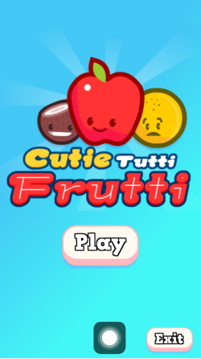
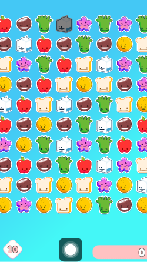
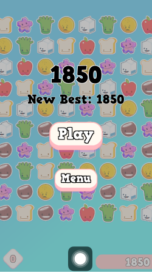

## Projekti kirjeldus
Projekt põhineb Jeff Fisheri juhendil https://www.raywenderlich.com/673-how-to-make-a-match-3-game-in-unity. Mängu ideeks on saada järjestikku kolm ühesugust ikooni. Seadistamiseks oli vaja installida Unity ning Visual Studio. Xcode oli mul olemas läbi mille testisin mängu telefonis. Kui käivitamisel tekib liPhone-lib.a error, siis tuleb Xcodes Build Settings alt otsida Library Search Path ning jätta alles ainult $(SRCROOT)/Libraries. Mängu käivitamiseks tuleb kogu kood avada Unitys ning File -> Build Settings -> Build on iOS. Tekkinud kaustas avada .xcodeproj fail ning valida General -> Signing -> Team, et saaks telefonis mängu avada.  

## Arvamus
Kõikidest kodutöödest kõige põhjalikum juhend. Iga koodirida oli tõesti väga hästi lahti seletatud ning kusagil ei tekkinud küsimust, mis mida teeb. Samuti oli jaotatud alapeatükkideks mugavalt, et oli võimalik testida pidevalt ning kas mäng ikka käivitub õigesti.

Kuna tegu on kahe aasta taguse juhendiga siis paar versiooni errorit oli, millele otsisin lahendused mujalt Internetist. 

## Muudatused
SDK versioonide osas muudatusi ei teinud. Muutsin ära nuppude ja skoori värvid ning ikooni telefonis. Vähendasin käikude arvu 99lt kümnele. Vähendasin veel ikoonide arvu y-teljel. Samuti kustutasin helifaili, mis muutus häirivaks. 

